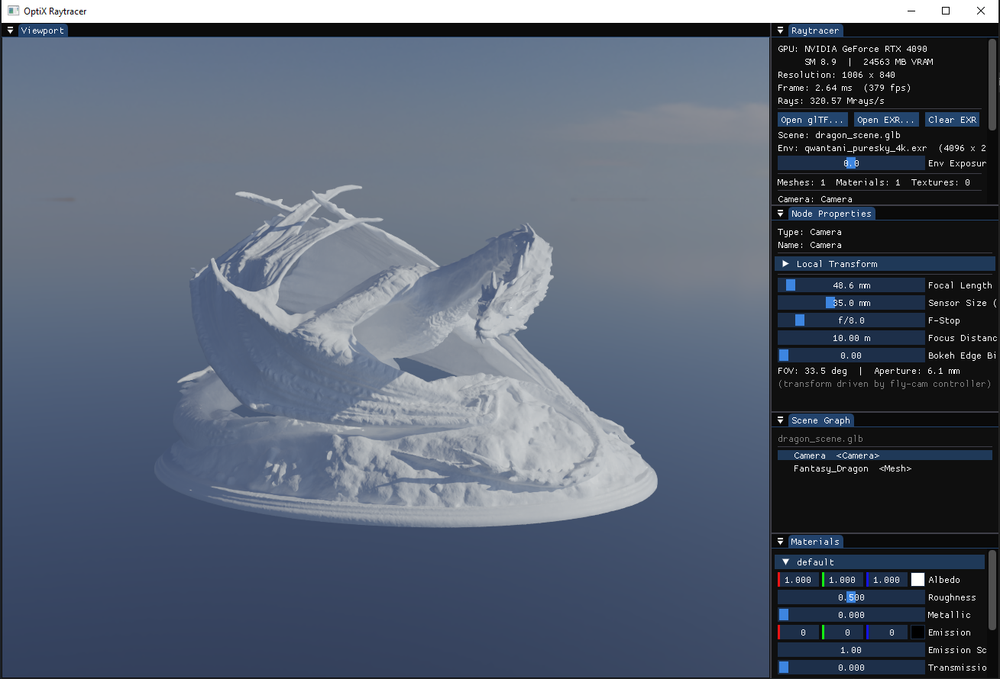

# OptiX Raytracer

A physically based GPU path tracer built on NVIDIA OptiX 9.x, CUDA, Vulkan, C++17, and Dear ImGui.



---

## Features

### Rendering
- **Monte Carlo path tracing** with up to 16 bounces and per-pixel progressive accumulation
- **PBR materials** (GGX-VNDF microfacet BRDF) — albedo, roughness, metallic, clearcoat, clearcoat roughness, emission, transmission, IOR, and absorption distance
- **Probabilistic lobe selection** — clearcoat → specular → diffuse/refraction, each weighted by Fresnel probability for energy conservation
- **Stochastic refraction** — rough dielectric transmission with Snell's law and GGX microfacet normal sampling; Beer-Lambert volumetric absorption for coloured glass
- **Environment lighting** — equirectangular EXR maps (`.exr`, all codecs: NONE / RLE / ZIP / PIZ / PXR24 / B44 / DWAA / DWAB) or Radiance HDR maps (`.hdr`) or procedural sky gradient, with rotation and exposure (EV) controls
- **HDRI importance sampling** — 2D luminance CDF built at load time; Next Event Estimation (NEE) fires shadow rays toward bright env-map regions at every diffuse bounce; Multiple Importance Sampling (MIS) power heuristic prevents double-counting with the regular BSDF path
- **Thin-lens depth of field** — focal length, sensor size, f-stop, focus distance, and adjustable bokeh edge bias
- **Reinhard tone mapping** with sRGB gamma encoding
- **OptiX AI denoiser** — normal + albedo guide layers, configurable denoise interval, keeps the last denoised frame while accumulating

### Scene
- **glTF 2.0 / GLB loading** — meshes, PBR materials (including `KHR_materials_transmission`, `KHR_materials_ior`, `KHR_materials_clearcoat`), base-colour textures, cameras, scene hierarchy
- **Scene graph** — full glTF node hierarchy preserved as a `Node3D` tree (`MeshNode`, `CameraNode`, `GroupNode`)
- **Node transforms applied to TLAS** — mesh instances positioned using accumulated world-space transforms from the node hierarchy
- **Live transform editing** — 3D gizmo (ImGuizmo) overlaid on the viewport for interactive Translate / Rotate / Scale in Local or World space; raw matrix fields remain available for precise values; TLAS-only rebuild keeps BLASes intact

### Camera
- **Free-fly camera** — WASD (move), EQ (up/down), right-drag (look), Ctrl+drag (orbit origin), Shift+drag (rotate environment)
- **Physical camera parameters** — focal length (mm), sensor size (mm), f-stop, and focus distance drive the FOV and depth of field
- **glTF camera import** — imported yFov converted to focal length at load time

### UI (Dear ImGui with docking)
| Panel | Contents |
|---|---|
| **Viewport** | Live rendered image, resizes dynamically |
| **Raytracer** | GPU stats, sample count, denoiser toggle, environment controls |
| **Resources** | Collapsible sub-categories: **Materials** (per-material PBR editor with albedo swatch preview) and **Textures** (loaded scene textures with dimensions and format) |
| **Scene Graph** | Hierarchy tree of all scene nodes (click to select) |
| **Node Properties** | Gizmo operation / space selector, TRS sliders, raw transform matrix, material editor, camera parameters for the selected node |

### Performance
- **PTX hot-reload** — edit `devicePrograms.cu`, rebuild the PTX, and the shader reloads without restarting; accumulation resets automatically
- **BLAS compaction** — per-mesh bottom-level AS built with size compaction
- **Frame-time EMA** — smoothed frame time and Mrays/s display

---

## Prerequisites

| Requirement | Version | Notes |
|---|---|---|
| NVIDIA GPU | Compute capability ≥ 7.5 | RTX 20xx / 30xx / 40xx |
| NVIDIA Driver | ≥ 570.x | Required by OptiX 9.1 |
| [NVIDIA OptiX SDK](https://developer.nvidia.com/optix) | 9.1.0 | Free download; requires NVIDIA developer account |
| [CUDA Toolkit](https://developer.nvidia.com/cuda-downloads) | 12.x or 13.x | Installs `nvcc` and CUDA runtime |
| [Vulkan SDK](https://vulkan.lunarg.com/) | ≥ 1.3 | Installs headers, loader, and validation layers |
| **Windows:** [Visual Studio 2022](https://visualstudio.microsoft.com/) | 17.x | With **Desktop development with C++** and **CUDA** workloads |
| **Linux:** GCC | ≤ 15 | CUDA 13.x does not support GCC 16+; install `gcc15`/`g++15` alongside the system compiler |
| [CMake](https://cmake.org/download/) | ≥ 3.20 | Add to PATH during install |
| **Linux:** Ninja *(optional)* | any | Used automatically if present; falls back to Unix Makefiles |

> **Driver check**: Run `nvidia-smi`. The driver version appears top-right. If below 570, download the latest from [nvidia.com/drivers](https://www.nvidia.com/drivers).

> **Vulkan check**: Run `vulkaninfo`. If absent, install Vulkan headers and the loader — on Arch: `sudo pacman -S vulkan-icd-loader vulkan-headers`; ensure `VULKAN_SDK` is set if using the LunarG SDK tarball.

---

## Building

### Linux (Arch / other distros)

`build.sh` in the repository root handles configure and build in one step. It automatically selects `g++-15` as the compiler when available (required for CUDA 13.x compatibility) and picks Ninja if installed.

```bash
# First time: add CUDA to PATH
echo 'export PATH="/opt/cuda/bin:$PATH"' >> ~/.bashrc
echo 'export LD_LIBRARY_PATH="/opt/cuda/lib64:$LD_LIBRARY_PATH"' >> ~/.bashrc
source ~/.bashrc

# Build (Release by default)
./build.sh

# Debug build
./build.sh Debug

# Force a clean reconfigure (required when changing compiler or generator)
./build.sh --clean

# If OptiX is not auto-detected:
./build.sh -DOptiX_INSTALL_DIR=~/NVIDIA-OptiX-SDK-9.1.0
# or: export OptiX_INSTALL_DIR=~/NVIDIA-OptiX-SDK-9.1.0
```

On first run, CMake fetches GLFW, ImGui, ImGuizmo, tinygltf, Imath, OpenEXR, and nativefiledialog-extended from GitHub — internet access is required.

**Run:**
```bash
./build/bin/Release/OptixRaytracer
```

---

### Windows

Two batch scripts are provided in the repository root:

| Script | Purpose |
|---|---|
| `configure.bat` | Generate (or refresh) the Visual Studio solution |
| `build.bat` | Configure if needed, then compile |

**Command line:**

```bat
build.bat          :: Debug build (configures automatically on first run)
build.bat Release  :: Release build
```

**Visual Studio:**

```bat
configure.bat          :: Generate build\OptixRaytracer.sln
configure.bat --clean  :: Wipe CMake cache first, then regenerate
```

Open `build\OptixRaytracer.sln`. **OptixRaytracer** is the startup project — press **F5** to run. Re-run `configure.bat` after adding/removing source files or changing `CMakeLists.txt`.

**Manual CMake:**

```powershell
cmake -S . -B build -G "Visual Studio 17 2022" -A x64

# If OptiX is not detected automatically:
cmake -S . -B build -G "Visual Studio 17 2022" -A x64 `
    -DOptiX_INSTALL_DIR="C:/ProgramData/NVIDIA Corporation/OptiX SDK 9.1.0"

cmake --build build --config Debug   --parallel
cmake --build build --config Release --parallel
```

**Run:**

```powershell
.\build\bin\Debug\OptixRaytracer.exe
```

---

## Controls

| Input | Action |
|---|---|
| **RMB drag** | Free-look (rotate camera orientation) |
| **Ctrl + RMB drag** | Orbit camera around world origin |
| **Shift + RMB drag** | Rotate environment map azimuthally |
| **W / S** | Move forward / backward |
| **A / D** | Strafe left / right |
| **E / Q** | Move up / down |
| **Click node in Scene Graph** | Select node; 3D gizmo appears in Viewport |
| **Drag gizmo handle** | Translate / rotate / scale the selected node |
| **Translate / Rotate / Scale buttons** | Switch gizmo operation (Node Properties panel) |
| **1 / 2 / 3** | Keyboard shortcut: Scale / Rotate / Translate |
| **Local / World buttons** | Switch gizmo reference space (Node Properties panel) |
| **Open glTF…** | Browse for `.gltf` or `.glb` scene file |
| **Open Env Map…** | Browse for an equirectangular environment map (`.exr` or `.hdr`) |
| **Clear** | Remove the environment map (falls back to procedural sky) |

---

## Project Structure

```
Optix-Raytracer/
├── CMakeLists.txt              Root build: project settings, FetchContent, subdirs
├── build.sh                    Linux build script (configure + compile)
├── build.bat / configure.bat   Windows build scripts
├── imgui.ini                   Versioned default Dear ImGui window layout
├── app.PNG                     Application screenshot
├── cmake/
│   ├── FindOptiX.cmake         Locates the OptiX SDK; creates the OptiX::OptiX target
│   ├── cuda_intellisense.props.in  VS property sheet: adds OptiX to IntelliSense
│   └── InstallDefaultIni.cmake Install imgui.ini next to the exe on first build
├── shaders/
│   ├── device_math.h           float3 operator overloads (+ − * / for device and host)
│   ├── LaunchParams.h          GPU parameter struct shared between host and device
│   ├── SceneData.h             MeshData and MaterialData (no STL; host + device)
│   └── devicePrograms.cu       OptiX device programs — iterative path tracer,
│                               HDRI importance sampling, NEE shadow rays, MIS
└── src/
    ├── main.cpp                Entry point
    ├── Application.h/.cpp      CUDA/OptiX init, ImGui UI, per-frame render loop
    ├── VulkanContext.h/.cpp    Vulkan device, swapchain, render pass, display image,
    │                           and per-frame present logic
    ├── Matrix4x4.h             Row-major Matrix4x4 with multiply, inverse, and
    │                           column-major converters for ImGuizmo interop
    ├── Camera.h                Camera struct: transform, FOV, DoF parameters
    ├── Node3D.h                Node3D base + MeshNode, CameraNode, GroupNode
    ├── Scene.h/.cpp            Scene container: meshes, materials, textures, node tree
    ├── Mesh.h                  Host-side mesh: separate vertex attribute arrays
    ├── Texture.h/.cpp          RAII GPU texture class: RGBA8 / RGBA32F; EXR loading
    │                           via OpenEXR (all codecs), HDR loading via stb_image,
    │                           GPU upload, HDRI importance-sampling CDF
    ├── Accel.h/.cpp            OptiX acceleration structure: BLAS per mesh + TLAS
    ├── SceneLoader.h/.cpp      glTF 2.0 loader (tinygltf); populates Scene from file
    └── CMakeLists.txt          Executable target, include paths, link libraries
```

---

## Troubleshooting

**`OptiX SDK not found`**  
Pass `-DOptiX_INSTALL_DIR=...` to the CMake configure command, or set the environment variable `OptiX_INSTALL_DIR`.  
- Windows default: `C:/ProgramData/NVIDIA Corporation/OptiX SDK <version>`  
- Linux: `~/NVIDIA-OptiX-SDK-<version>`

**`optixInit() failed` or crash on startup**  
Your NVIDIA driver is too old. Update to ≥ 570.x from [nvidia.com/drivers](https://www.nvidia.com/drivers).

**`nvcc` not found during configure (Linux)**  
CUDA Toolkit is not on PATH. Add `/opt/cuda/bin` to `PATH` in `~/.bashrc` (see build instructions above).

**`nvcc` not found during configure (Windows)**  
CUDA Toolkit is not on PATH. Reinstall CUDA Toolkit and ensure it is added to PATH, or open the project from a **Visual Studio Developer Command Prompt**.

**`CUDA : error : Cannot find compiler 'cl.exe'`** *(Windows)*  
Visual Studio C++ workload is missing. Open the VS Installer, modify the 2022 installation, and add **Desktop development with C++**.

**`fatal error: math.h: No such file or directory` or similar STL errors (Linux)**  
GCC 16+ is not supported by CUDA 13.x. Install `gcc15`/`g++15` — on Arch: `sudo pacman -S gcc15`. `build.sh` selects it automatically when present.

**`Vulkan SDK not found` during configure (Linux)**  
Install Vulkan headers and the ICD loader: `sudo pacman -S vulkan-icd-loader vulkan-headers` (Arch), then re-run `./build.sh --clean`.

**`Vulkan SDK not found` during configure (Windows)**  
Install the [Vulkan SDK](https://vulkan.lunarg.com/) and ensure the `VULKAN_SDK` environment variable is set (the installer does this automatically). Re-run `configure.bat` after installation.

**Black Viewport on startup**  
The Vulkan validation layer may be printing errors to stderr. Run from a terminal to see them. Common causes: outdated driver (update to ≥ 570.x) or missing Vulkan instance extensions from GLFW.

**Image is very dark or very bright**  
Adjust the **Env Exposure** slider in the Raytracer panel. For scenes with emissive materials adjust the emissive scale on the material.

**Scene with glass converges slowly despite HDRI**  
HDRI NEE fires only on diffuse bounces. Paths that escape through glass (transmission) follow the BSDF and are unaffected by NEE — this is correct behaviour. Increase `MAX_BOUNCES` in `devicePrograms.cu` if light needs more bounces to exit the glass.

**Depth of field has no visible effect**  
Ensure f-stop is low (try f/2 or f/1.4) and that objects in the scene are at a different distance from the **Focus Distance** setting in the Node Properties camera panel.

---

## License

GNU General Public License v3 — see [LICENSE](LICENSE).
